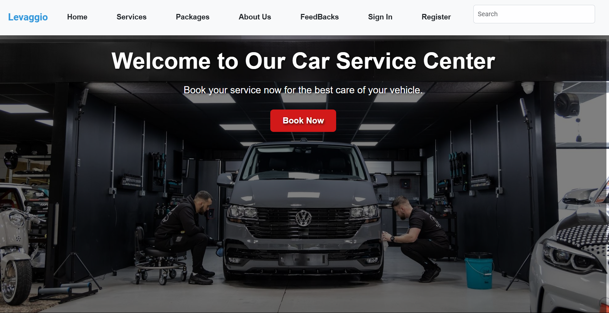

# 🚗 **Levaggio Vehicle Service Management System**

Welcome to **Levaggio**, a comprehensive **Vehicle Service Management System** designed to streamline operations for **Levaggio Car Service Station** in **Negombo, Sri Lanka**. This project, developed as part of our **2nd Year, 2nd Semester Information Technology Project (ITP)** module, addresses the challenges faced by Levaggio, which previously operated without an online system. Our solution simplifies management processes, improves efficiency, and enhances customer satisfaction. 

---

## 🏠 **Home Page Preview**

---

## 🎥 **Demo Video**  
👉 [Click here to watch the demo video!](https://mysliit-my.sharepoint.com/:v:/g/personal/it22546784_my_sliit_lk/EaxrE-AIrpxGt_Fc9_DVKL4B7fPXp-_x5OQvVjzV3OLfLw?e=JhE5o9&nav=eyJyZWZlcnJhbEluZm8iOnsicmVmZXJyYWxBcHAiOiJTdHJlYW1XZWJBcHAiLCJyZWZlcnJhbFZpZXciOiJTaGFyZURpYWxvZy1MaW5rIiwicmVmZXJyYWxBcHBQbGF0Zm9ybSI6IldlYiIsInJlZmVycmFsTW9kZSI6InZpZXcifX0%3D)  

---

## 🛠️ **Features**

### 🚀 **Comprehensive Admin Management**  
The system includes **8 key admin roles**, each designed to handle specific aspects of the business efficiently:  
- **System Operation Manager**: Oversees overall operations to ensure smooth system functionality.  
- **Trainee Manager**: Manages trainee assignments and performance.  
- **Service Record Manager**: Tracks vehicle service histories and updates records.  
- **Inventory Manager**: Monitors and updates inventory levels.  
- **Customer Service Manager**: Handles customer interactions and resolves service-related queries.  
- **Appointment Manager**: Schedules, updates, and tracks appointments.  
- **Employee Manager**: Manages employee profiles, roles, and attendance.  
- **Supplier Manager**: Maintains relationships with suppliers and tracks procurement.  

---

## 🏗️ **Technology Stack**
- **Frontend**: React.js, Vite, HTML, CSS, JavaScript, Bootstrap  
- **Backend**: Node.js, Express.js  
- **Database**: MongoDB  

---

## 🚀 **Getting Started**

### Prerequisites  
Ensure you have the following installed:  
- [Node.js](https://nodejs.org/)  
- [MongoDB](https://www.mongodb.com/)  

